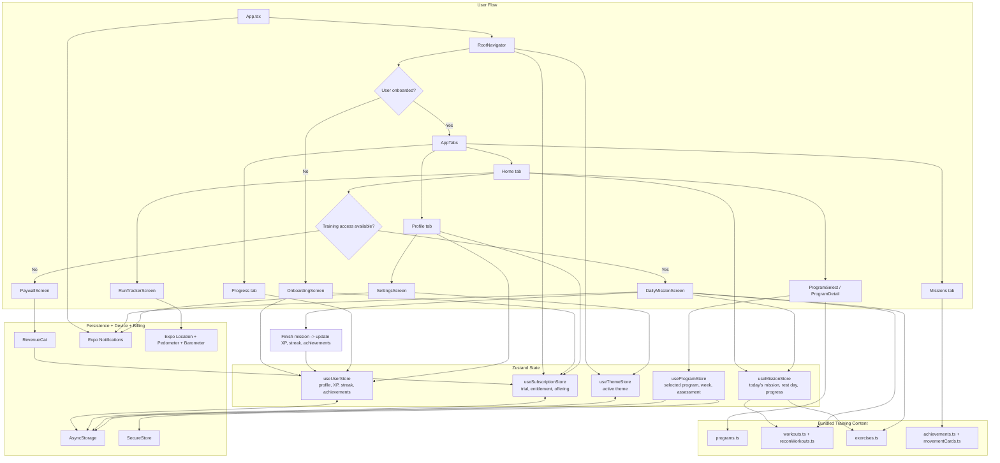

# Gruntz

Gruntz is a local-first Expo / React Native military fitness app. The main loop is:

1. onboard the user
2. choose a training program
3. load today's mission from bundled workout data
4. log the workout
5. award XP, streak progress, and achievements
6. gate long-term access through RevenueCat

## How The App Works



## Screen-Level Breakdown

- `Home` is the command center. It loads the selected program, computes today's mission, shows access state, and routes the user into the workout flow or paywall.
- `Missions` is the reference area for workout cards, movement cards, and achievements.
- `Progress` reads from `useUserStore` and turns saved mission history into XP, rank, totals, and record dashboards.
- `Profile` surfaces identity, membership, stats, program switching, and settings.
- `Settings` controls theme selection, notification reminders, and unit preferences.
- `Run Tracker` is a live sensor-driven screen for distance, pace, steps, and elevation.

## State And Data Model

- `useUserStore` is the main game-state store. It owns the profile, streak, XP, completed missions, and unlocked achievements.
- `useProgramStore` owns the active program, week number, and assessment inputs. General program state is stored in `AsyncStorage`; assessment data is stored in `SecureStore`.
- `useMissionStore` converts the selected program plus the current date into today's mission or rest-day state.
- `useSubscriptionStore` handles the 15-day free-access window plus RevenueCat entitlement state.
- Most training content is shipped in `src/data`, so the app does not need a backend to generate daily missions.

## Important Notes About The Current MVP

- The training loop is mostly local-first. Core workout generation, progression, and achievement logic run from bundled data and local persistence.
- RevenueCat is the main external product dependency in the app flow right now.
- Notifications are used for reminder scheduling, workout progress, mission completion, and achievement unlocks.
- The run tracker is live and sensor-based, but it is currently screen-local. Its session results are not yet written back into `useUserStore`.

## Run The App

```bash
npm start
npm run ios
npm run android
```
